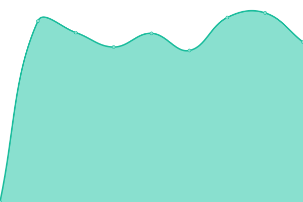
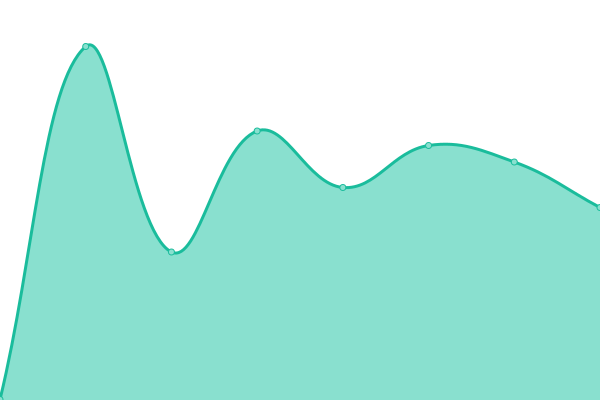
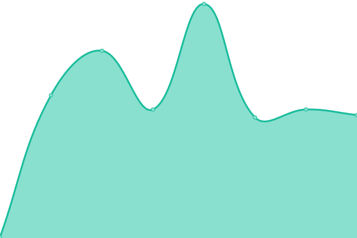
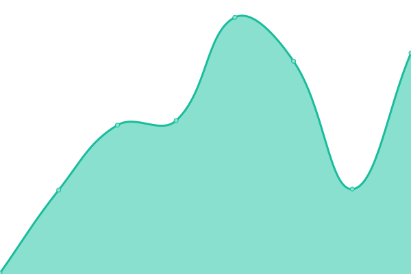

# [📈 Live Status](https://MamonakuCommittee.github.io/status): <!--live status--> **🟧 Partial outage**

This repository contains the open-source uptime monitor and status page for [Mamonaku Committee](mamonaku.io), powered by [Upptime](https://github.com/upptime/upptime).

With [Upptime](https://upptime.js.org), you can get your own unlimited and free uptime monitor and status page, powered entirely by a GitHub repository. We use [Issues](https://github.com/MamonakuCommittee/status/issues) as incident reports, [Actions](https://github.com/MamonakuCommittee/status/actions) as uptime monitors, and [Pages](https://MamonakuCommittee.github.io/status) for the status page.

<!--start: status pages-->
<!-- This summary is generated by Upptime (https://github.com/upptime/upptime) -->
<!-- Do not edit this manually, your changes will be overwritten -->
<!-- prettier-ignore -->
| URL | Status | History | Response Time | Uptime |
| --- | ------ | ------- | ------------- | ------ |
|  [JeremieBerduck.com](https://jeremieberduck.com) | 🟩 Up | [jeremie-berduck-com.yml](https://github.com/MamonakuCommittee/status/commits/HEAD/history/jeremie-berduck-com.yml) | 

 1180ms
     
 | 

<a href="https://mamonakucommittee.github.io/status/history/jeremie-berduck-com">100.00%</a>
    

|  [Shoobie.app](https://shoobie.app) | 🟩 Up | [shoobie-app.yml](https://github.com/MamonakuCommittee/status/commits/HEAD/history/shoobie-app.yml) | 

 585ms
     
 | 

<a href="https://mamonakucommittee.github.io/status/history/shoobie-app">100.00%</a>
    

|  [Mamonaku.io](https://mamonaku.io) | 🟥 Down | [mamonaku-io.yml](https://github.com/MamonakuCommittee/status/commits/HEAD/history/mamonaku-io.yml) | 

 0ms
     
 | 

<a href="https://mamonakucommittee.github.io/status/history/mamonaku-io">0.00%</a>
    

|  World Tides API | 🟥 Down | [world-tides-api.yml](https://github.com/MamonakuCommittee/status/commits/HEAD/history/world-tides-api.yml) | 

 270ms
     
 | 

<a href="https://mamonakucommittee.github.io/status/history/world-tides-api">0.00%</a>
    

|  World Weather Online API | 🟥 Down | [world-weather-online-api.yml](https://github.com/MamonakuCommittee/status/commits/HEAD/history/world-weather-online-api.yml) | 

 193ms
     
 | 

<a href="https://mamonakucommittee.github.io/status/history/world-weather-online-api">0.00%</a>
    

|  Open Weather API | 🟥 Down | [open-weather-api.yml](https://github.com/MamonakuCommittee/status/commits/HEAD/history/open-weather-api.yml) | 

 42ms
     
 | 

<a href="https://mamonakucommittee.github.io/status/history/open-weather-api">0.00%</a>
    

<!--end: status pages-->

[**Visit our status website →**](https://MamonakuCommittee.github.io/status)

## 📄 License

- Powered by: [Upptime](https://github.com/upptime/upptime)
- Code: [MIT](./LICENSE) © [Mamonaku Committee](mamonaku.io)
- Data in the `./history` directory: [Open Database License](https://opendatacommons.org/licenses/odbl/1-0/)
